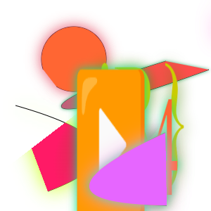
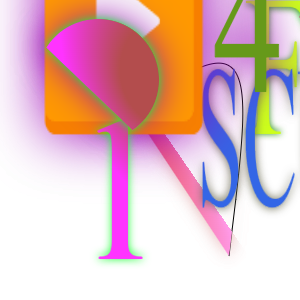
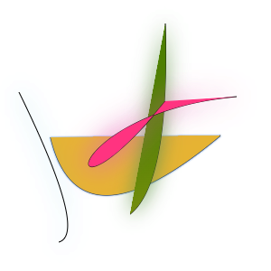

# Illustrating canvas fingerprinting

Canvas fingerprinting is a relatively well-understood and [well-documented](https://en.wikipedia.org/wiki/Canvas_fingerprinting) technique: websites can use [web APIs](https://developer.mozilla.org/en-US/docs/Web/API/Canvas_API) to access 2D and 3D rendering APIs inside the browser, which instruct the brower to draw lines, gradients, text, and other objects onto raster images. The same sequence of API calls can produce subtly different images depending on your browser, OS, the set of fonts you have installed, your GPU driver, and so on. The images that your browser renders therefore provide a useful signal, and when it is combined with information available through other browser APIs, it [could be used to identify your device uniquely](https://coveryourtracks.eff.org/).

For a technique that relies on asking your browser to paint a picture that expresses its entire unique personality, few sources actually _show_ you much of what these pictures look like. To rectify that, I made [a Chrome extension](https://github.com/aleksejspopovs/canvas-logger) that logs every canvas that a website attempted to read back and browsed the web for a week with the extension enabled. Here's an extremely unscientific account of what I saw.

(Some of the images in this post have been cropped, but only to remove large areas of fully transparent pixels.)

## BrowserLeaks.com

BrowserLeaks.com seems to have been one of the first public implementations of canvas fingerprinting, appearing online in early 2013. As we're about to see, it seems to have inspired many of the other implementations.

The image is not particularly visually striking, but I want to draw your attention to the orange rectangle under the word `<canvas>`. Take a good look at it, appreciate its color, and try to remember it---you're going to see it again.

Interestingly, the current version of BrowserLeaks.com uses a clever trick that attempts to defeat extensions like mine. BrowserLeaks.com creates a sandboxed iframe where JavaScript (including the hooking code from my extension) will not execute, then accesses it from the parent frame to get a `<canvas>` element whose `toDataURL` method has not been hooked. Once you know about it, though, you can [use the same trick](https://github.com/aleksejspopovs/canvas-logger/blob/dad9f37d3718509151d202b214c8f536c70596e8/extension/scripts/content.js#L67-L108) to hook them too. I have not seen any other site use this trick.

## ClickCease

I'm honestly not sure that ClickCease is anybody that matters, but I am including it here because it's funny just how obvious of a ripoff it is. The orange rectangle is still there but no longer under anything specific.

## PayPal

PayPal has got better alignment on the orange rectangle, keeps the green text with a green shadow, but adds some color composition operations. We're about to see a lot more of this.

## FingerprintJS and variants

![The string "Cwm fjordbank glyphs vext quiz, 😃" is rendered twice, once in blue in a smaller font and once in semi-transparent light green in a larger font. The orange rectangle from BrowserLeaks.com is still present in its original location, now roughly under "hs vext qui". Under the text, the Venn diagram from PayPal has had multiple additional circles and triangles in primary colors added to it, combining into a sort of a Technicolor Rorschach test. (The image has been cropped from its original size of 2000×200, removing a large area of empty space.)](./samples/processed/fingerprintjs-longer-string-cropped.png)

Told you. FingerprintJS is a very common open source fingerprinting library. It uses color blending and emojis to extract more entropy.

(Hey, the orange rectangle is still there! It has the exact same color, size, and almost the same position as the one from BrowserLeaks.com.)

It has been integrated into many commercial products, including at least Arkose, Geetest, Yandex SmartCaptcha, DDoS-Guard, and Sift. The exact version of the library integrated into products varies, so you can see the evolution of the technique as you run into different samples on the web. Most of the changes concern the exact string being rendered:

- A very old version [used a string calling for peace in Ukraine](https://github.com/fingerprintjs/fingerprintjs/blob/0f523619975692cdb91400d0f2f9c2ab26d2cb61/fingerprint2.js#L485) back in 2015. I did not find any instances of this version in the wild, though.

- Before v3 of FingerprintJS, the string was a proper pangram, containing each letter of the English alphabet exactly once, rendered onto a giant and mostly blank 2000×200 canvas. In v3, the string was shortened and the canvas cropped to just the useful part:

- Having an emoji in the middle of a string turned out to cause [inconsistent amounts of padding on the right in Chrome](https://github.com/fingerprintjs/fingerprintjs/issues/574), so the emoji was moved to the end. I have no samples illustrating this change individually because it happened in the same version of the library (v3.1.0) as the next one.

- Eventually FingerprintJS [split](https://github.com/fingerprintjs/fingerprintjs/commit/d3e359c4fe81f58793751361d495c36d6be7e73d) the canvas fingerprint into two images to separate text, which was still suffering from inconsistent rendering on [some](https://github.com/fingerprintjs/fingerprintjs/issues/583) [platforms](https://github.com/fingerprintjs/fingerprintjs/issues/103), from the more stable blending-based fingerprint:

- On CoinMarketCap, the characters 馃槂 are rendered instead of the emoji, but this does not appear to be intentional. Rather, it is a result of the source code having gotten interpreted with the wrong encoding at some point, as `'😃'.encode('utf-8').decode('gbk') == '馃槂'`.

FingerprintJS also implements WebGL fingerprinting, which uses 3D rendering primites instead of 2D ones. Depending on the version, it renders one of these two triangles:

## Amazon and AWS WAF

Amazon has its own fingerprinting library that is used both on the retail Amazon.com website and in its AWS WAF product. Though heavily customized, it, too, seems to be based on FingerprintJS. Say hello one last time to our good friend the orange rectangle!

## SHIELD

What have they done to you, orange rectangle?! Some transposed letters and a shruggie seems to be most of what SHIELD has to offer when it comes to canvas fingerprinting.

## Akamai

I appreciate the transparency with which Akamai's fingerprinting image announces what's going on. WebKit developers appreciated it too, implementing a quirk that [returns a hardcoded data URL for canvases where the last drawn string is `<@nv45. F1n63r,Pr1n71n6!`](https://github.com/WebKit/WebKit/blob/a99abdd4861553671d45fcd3b11714c82a803421/Source/WebCore/page/Quirks.cpp#L1580-L1623). Firefox's Gecko has [similar logic](https://github.com/mozilla/gecko-dev/blob/f961e5f2a22f4d41733545190892296e64c06858/dom/canvas/CanvasRenderingContext2D.cpp#L4203-L4222) for this and a couple other strings, too.

Akamai also implements some sort of a challenge-response protocol that seems to involve rendering random three-digit numbers to the canvas.

Sometimes, but not always, Akamai also renders this red image. In the top left corner, very faint, nearly transparent letters spell out "Soft Ruddy Foothold 2". I kind of like it.

![Bright red letters spell out "!H71JCaj)\]# 1@#". Behind, in faint semi-transprent red, "Soft Ruddy Foothold 2". Under, three rectangles: red, blue, and gray.](./samples/akamai-rare.png)

## ThreatMetrix

ThreatMetrix has another one of those self-referential images that tells you exactly what it is. Nice gradient on there.

I think they're doing something clever with their iframes, because, while my extension successfully hooked the toDataURL call, the message it sent to itself with postMessage never arrived.

## Cloudflare Turnstile

This one's kind of cool-looking, I have to admit. It's a shame it's Cloudflare's.

Turnstile is the only CAPTCHA solution that seems to actually detect that something's wrong when my canvas logging extension is running. All of my challenges fail with "Error: 600010". The code is heavily obfuscated, so I didn't get around to figuring out how they detect it. It's got to be interesting, so maybe that's a task for another day.

## Shape Security

Shape Security (now owned by F5) has got the most fun canvas-based bot detection mechanisms. Sure, their text-based fingerprinting image looks pretty basic, and the WebGL triangle is not far ahead, but check these out:

I haven't spent any time reverse engineering this, but many teenagers trying to buy fancy sneakers have, and what I understand from reading their notes is that this is a challenge-response protocol where Shape's server sends you obfuscated bytecode for their custom VM that proceeds to draw these pictures and sends them back, presumably to be compared against what the server expects them to look like. It's not quite fingerprinting in the classical sense, since the image is different on every page load, but it means that writing a bot for a Shape-protected website requires access to some sort of a drawing API. Neat!

Shape also fingerprints your emoji font by drawing multiple emojis and then reading back just a single pixel or two in specific, pre-determined locations. I imagine that Emoji fonts are  are usually provided by the OS and get subtly modified between different OS releases (I am surprised not to see [the gun emoji](https://blog.emojipedia.org/apple-and-the-gun-emoji/) among those probed), and sampling individual pixels could be more effective for emoji than the more traditional font fingerprinting techniques that [rely on font metrics](https://browserleaks.com/fonts).

Notice the first two images, where instead of an emoji we see the beginning of a string like `\u2615`, which is one way to write the emoji ☕ in JavaScript.  At first I thought that my system lacked support for this emoji and what I was seeing was some sort of fallback behavior, but when I traced the code I realized that it really was printing the literal six-character string `"\\u2615"`. I am assuming this is meant to confuse people reverse engineering this (it sure confused me) and trick them into double-decoding the input.

Finally, Shape does something odd: it renders the string `Hel$&?6%){mZ+#@👺` at coordinates (105, 105) of a canvas that is only 5×5 pixels large. Naturally, the image comes back empty, so its contents themselves provide no useful information. I think this is being used as some sort of a side channel for the anti-tracking protections in Firefox, where writing a string that begins with `Hel$&?6%` [gets your canvas marked as being involved in fingerprinting](https://github.com/mozilla/gecko-dev/blob/f961e5f2a22f4d41733545190892296e64c06858/dom/canvas/CanvasRenderingContext2D.cpp#L4217).

## Anura

![An image that looks like an early 2000s elementary school student's first foray into WordArt. The background is striped diagonally in light gray, and the image has a border that is also striped diagonally in black. In the middle, a red rectangle and thin blue, gray, and yellow stripes. Strings "ϋϱϥϨϙϬ...", "Sympathizing would fix Quaker objectives", "{CD24:PD24}", "WebGL 2.0 (OpenGL ES 3.0 Chromium)", and "ANGLE (Intel, Mesa Intel(R) Xe Graphics (TGL GT2), OpenGL 4.6)" are rendered with shadows in mismatched colors. In the middle of the image, a very large zero, a large orange circle, a light blue star, and, in toxic purple and lime green, the text "ANURA RULES!" appears, rotated slightly by around 12°.](./samples/anura.png)

I am in love with this one. This was made by somebody with true respect for their craft. I would like the Federal Reserve to recall all dollar banknotes and replace them with whatever this is.

## DataDome

There's a lot going on with DataDome! This is another challenge-response situation where you get a new picture each time. This one takes a snapshot of each individual step as the picture is drawn. 

DataDome also printed this cool warning to my console:

## PerimeterX

PerimeterX seems to be getting most of its canvas-based signal from emoji and other Unicode characters, as well as a very wide version of the WebGL triangle we've seen before.

## hCaptcha

hCaptcha also renders emoji. It also renders some small 2×2 squares whose purpose I could not immediately identify.

## Conviva

NICE CROPPING, SHITLORD

